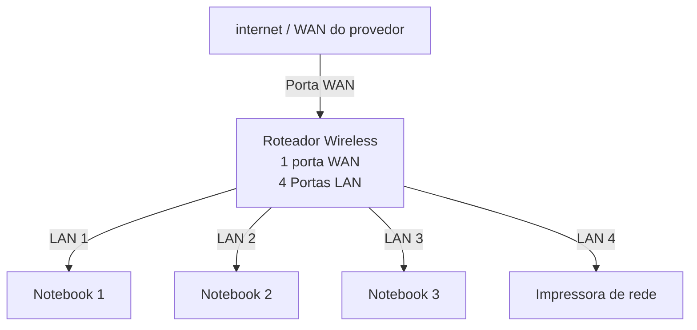
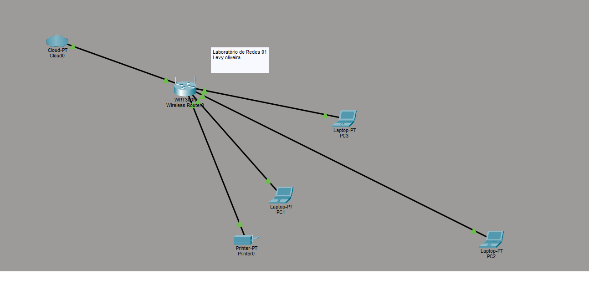

#laboratório de redes 01 projeto de rede local

aluno: levy oliveira

professor:josé de assis

data:09/03/2026

---

## 1. objetivo
implementar uma rede local simples conectando 3 notebooks a um roteador wireless com swuitch e uma impressora de rede.

o projeto será dividido em duas etapas?

1. simulação da rede no Cisco Packet Tracer
2. implementação da rede no laboratório real

 ---

 ## 2. equipamentos utilizados neste laboratório:
 - 3 Notebooks
 - 1 Roteador wireless com 1 porta WAN e 4 portas LAN
 - 1 Impressora de Rede
 - Cabos de Rede

 ---

 ## 3. Topologia da Rede
 
 Diagrama lógico da rede usada neste laboratório
 

Imagem da topologia usada neste laboratório:

---

## 4. Plano de Endereçamento de IP

rede: 192.168.0.0/24

 Gateway: 192.168.0.1

| Dispositivo |Tipo de IP | Endereço IP | Observação |
|-------------|-------------|-------------|-------------|
| Roteador | Estatico | 192.168.0.1 | IP reservado pelo Roteador|
| PC1 | Reserva DHCP | 192.168.0.105 | IP reservado pelo roteador |
| pc2 | DHCP | Automático | IP atribuído pelo roteador |
| pc3 | DHCP | Automático | IP atribuído pelo roteador |

**Observação**

-A impressora e um dos notebooks utilizam reserva DHCP.
-O roteador sempre atribui o mesmo endereco IP a esses dispositivos.

---

## 5. implementação do laboratório real 

após a instalação , a rede foi montada fisicamente no laboratório.

etapas realizadas:

(fotos e capturas de tela realizadas durante o laboratório)

Testes:

(fotos e capturas de tela realizadas durante o laboratório)

---

## 6. Conclusão

Este laboratório permitiu compreender o funcionamento de umna rede local simples, incluindo:

- estrutura de uma rede doméstica ou de pequeno escritório (rede local)
- utilização de um roteador com porta WAN e portas LAN
- funcionamento do DHCP
- comunicação entre dispositivos na rede local
- utilização de uma impressora de rede
- compartilhamento de pasta na rede usando o windows
- jogos em rede
